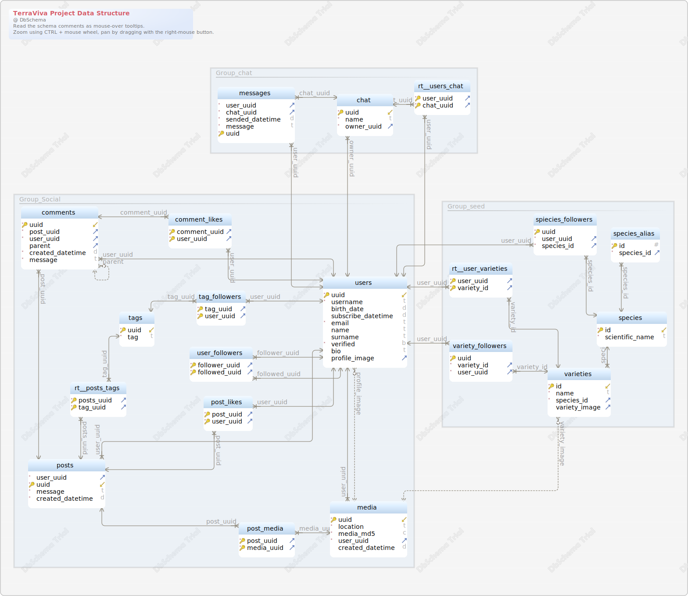

# TerraViva Project Data Structure

- [TerraViva Project Data Structure](#terraviva-project-data-structure)
  * [Table chat](#table-chat)
  * [Table comment_likes](#table-comment_likes)
  * [Table comments](#table-comments)
  * [Table media](#table-media)
  * [Table messages](#table-messages)
  * [Table post_likes](#table-post_likes)
  * [Table post_media](#table-post_media)
  * [Table posts](#table-posts)
  * [Table rt__posts_tags](#table-rt__posts_tags)
  * [Table rt__user_varieties](#table-rt__user_varieties)
  * [Table rt__users_chat](#table-rt__users_chat)
  * [Table species](#table-species)
  * [Table species_alias](#table-species_alias)
  * [Table spiecies_followers](#table-spiecies_followers)
  * [Table tag_followers](#table-tag_followers)
  * [Table tags](#table-tags)
  * [Table user_followers](#table-user_followers)
  * [Table users](#table-users)
  * [Table varieties](#table-varieties)
  * [Table variety_followers](#table-variety_followers)

## Table chat 
This table contains informations about the chat

| Idx | Field Name | Data Type | Description |
|---|---|---|---|
| *🔑 ⬋ | <a name='terraviva+project+data+structure.chat_uuid'>uuid</a>| UUID  DEFAULT uuid() | This field contains the uuid of the chat |
| *| <a name='terraviva+project+data+structure.chat_name'>name</a>| VARCHAR&#40;100&#41;  | This field contains the name of the chat |
| *⬈ | <a name='terraviva+project+data+structure.chat_owner_uuid'>owner&#95;uuid</a>| UUID  | This field contains the reference about the owner of the chat |
| Indexes |
| 🔑 | pk&#95;chat || ON uuid |  |
| Foreign Keys |
|  | fk_chat_users | ( owner&#95;uuid ) ref [terraviva project data structure&#46;users](#users) (uuid) |  |
| Options |
| engine&#61;InnoDB |

## Table comment_likes 
This table contains informations about the comment likes

| Idx | Field Name | Data Type | Description |
|---|---|---|---|
| *🔑 ⬈ | <a name='terraviva+project+data+structure.comment_likes_comment_uuid'>comment&#95;uuid</a>| UUID  | This field contains the reference of the liked comment |
| *🔑 ⬈ | <a name='terraviva+project+data+structure.comment_likes_user_uuid'>user&#95;uuid</a>| UUID  | This field contains the reference about the user that likes the comment |
| Indexes |
| 🔑 | pk&#95;comment&#95;likes || ON comment&#95;uuid&#44; user&#95;uuid |  |
| Foreign Keys |
|  | fk_comment_likes_comments | ( comment&#95;uuid ) ref [terraviva project data structure&#46;comments](#comments) (uuid) |  |
|  | fk_comment_likes_users | ( user&#95;uuid ) ref [terraviva project data structure&#46;users](#users) (uuid) |  |
| Options |
| engine&#61;InnoDB |

## Table comments 
This table contains informations about the comments

| Idx | Field Name | Data Type | Description |
|---|---|---|---|
| *🔑 ⬋ | <a name='terraviva+project+data+structure.comments_uuid'>uuid</a>| UUID  DEFAULT uuid() | This field contains the uuid of the comment |
| *⬈ | <a name='terraviva+project+data+structure.comments_post_uuid'>post&#95;uuid</a>| UUID  | This field contains the reference of the commented post |
| *⬈ | <a name='terraviva+project+data+structure.comments_user_uuid'>user&#95;uuid</a>| UUID  | This field contains the reference about the user that made the comment |
| ⬈ | <a name='terraviva+project+data+structure.comments_parent'>parent</a>| UUID  |  |
| *| <a name='terraviva+project+data+structure.comments_created_datetime'>created&#95;datetime</a>| DATETIME  DEFAULT CURRENT_TIMESTAMP | This field contains the date and the time about the comment |
| *| <a name='terraviva+project+data+structure.comments_message'>message</a>| VARCHAR&#40;500&#41;  | This field contains the message of the comment |
| Indexes |
| 🔑 | pk&#95;comments || ON uuid |  |
| Foreign Keys |
|  | fk_comments_comments | ( parent ) ref [terraviva project data structure&#46;comments](#comments) (uuid) |  |
|  | fk_comments_posts | ( post&#95;uuid ) ref [terraviva project data structure&#46;posts](#posts) (uuid) |  |
|  | fk_comments_users | ( user&#95;uuid ) ref [terraviva project data structure&#46;users](#users) (uuid) |  |
| Options |
| engine&#61;InnoDB |

## Table media 
This table contains informations about media

| Idx | Field Name | Data Type | Description |
|---|---|---|---|
| *🔑 ⬋ | <a name='terraviva+project+data+structure.media_uuid'>uuid</a>| UUID  DEFAULT uuid() | This field contains the uuid of the media |
| *| <a name='terraviva+project+data+structure.media_location'>location</a>| VARCHAR&#40;500&#41;  | This field contains the location of the media |
| *| <a name='terraviva+project+data+structure.media_media_md5'>media&#95;md5</a>| CHAR&#40;32&#41;  | This field contains the content of the media |
| *⬈ | <a name='terraviva+project+data+structure.media_user_uuid'>user&#95;uuid</a>| UUID  | This field contains the reference about the user that load the media |
|  | <a name='terraviva+project+data+structure.media_created_datetime'>created&#95;datetime</a>| DATETIME  DEFAULT CURRENT_TIMESTAMP | This field contains the date and the time about the media |
| Indexes |
| 🔑 | pk&#95;medias || ON uuid |  |
| Foreign Keys |
|  | fk_medias_users | ( user&#95;uuid ) ref [terraviva project data structure&#46;users](#users) (uuid) |  |
| Options |
| engine&#61;InnoDB |

## Table messages 
This table contains informatio about sended message

| Idx | Field Name | Data Type | Description |
|---|---|---|---|
| *⬈ | <a name='terraviva+project+data+structure.messages_user_uuid'>user&#95;uuid</a>| UUID  | This field contains the reference about the user that have sent the message |
| *⬈ | <a name='terraviva+project+data+structure.messages_chat_uuid'>chat&#95;uuid</a>| UUID  | This field contains the reference about the chat that own the message |
| *| <a name='terraviva+project+data+structure.messages_sended_datetime'>sended&#95;datetime</a>| DATETIME  DEFAULT CURRENT_TIMESTAMP | This field contains the date and the time about the message |
| *| <a name='terraviva+project+data+structure.messages_message'>message</a>| VARCHAR&#40;1000&#41;  | this field contains the message sent |
| *🔑 | <a name='terraviva+project+data+structure.messages_uuid'>uuid</a>| UUID  | This field contains the uuid of the message |
| Indexes |
| 🔑 | pk&#95;messages || ON uuid |  |
| Foreign Keys |
|  | fk_messages_users | ( user&#95;uuid ) ref [terraviva project data structure&#46;users](#users) (uuid) |  |
|  | fk_messages_chat | ( chat&#95;uuid ) ref [terraviva project data structure&#46;chat](#chat) (uuid) |  |
| Options |
| engine&#61;InnoDB |

## Table post_likes 
This table contains informations about the posts likes

| Idx | Field Name | Data Type | Description |
|---|---|---|---|
| *🔑 ⬈ | <a name='terraviva+project+data+structure.post_likes_post_uuid'>post&#95;uuid</a>| UUID  | This field contains the reference about the liked post |
| *🔑 ⬈ | <a name='terraviva+project+data+structure.post_likes_user_uuid'>user&#95;uuid</a>| UUID  | This field contains the reference about the user who likes the post |
| Indexes |
| 🔑 | pk&#95;post&#95;likes || ON post&#95;uuid&#44; user&#95;uuid |  |
| Foreign Keys |
|  | fk_post_likes_posts | ( post&#95;uuid ) ref [terraviva project data structure&#46;posts](#posts) (uuid) |  |
|  | fk_post_likes_users | ( user&#95;uuid ) ref [terraviva project data structure&#46;users](#users) (uuid) |  |

## Table post_media 
This table contains informations about the posts media

| Idx | Field Name | Data Type | Description |
|---|---|---|---|
| *🔑 ⬈ | <a name='terraviva+project+data+structure.post_media_post_uuid'>post&#95;uuid</a>| UUID  | This field contains the reference about the post that include a media |
| *🔑 ⬈ | <a name='terraviva+project+data+structure.post_media_media_uuid'>media&#95;uuid</a>| UUID  | This table contains the reference about the media of the post |
| Indexes |
| 🔑 | pk&#95;post&#95;media || ON post&#95;uuid&#44; media&#95;uuid |  |
| Foreign Keys |
|  | fk_post_media_posts | ( post&#95;uuid ) ref [terraviva project data structure&#46;posts](#posts) (uuid) |  |
|  | fk_post_media_media | ( media&#95;uuid ) ref [terraviva project data structure&#46;media](#media) (uuid) |  |
| Options |
| engine&#61;InnoDB |

## Table posts 
This table contains informations about the posts

| Idx | Field Name | Data Type | Description |
|---|---|---|---|
| *⬈ | <a name='terraviva+project+data+structure.posts_user_uuid'>user&#95;uuid</a>| UUID  | This field contains the reference about the user who made the post |
| *🔑 ⬋ | <a name='terraviva+project+data+structure.posts_uuid'>uuid</a>| UUID  DEFAULT uuid() | This field contains the uuid of the post |
| *| <a name='terraviva+project+data+structure.posts_message'>message</a>| VARCHAR&#40;1000&#41;  | This field contains the message of the post |
| *| <a name='terraviva+project+data+structure.posts_created_datetime'>created&#95;datetime</a>| DATETIME  DEFAULT CURRENT_TIMESTAMP | This field contains the date and the time about the post |
| Indexes |
| 🔑 | pk&#95;posts || ON uuid |  |
| Foreign Keys |
|  | fk_users_posts | ( user&#95;uuid ) ref [terraviva project data structure&#46;users](#users) (uuid) |  |
| Options |
| engine&#61;InnoDB |

## Table rt__posts_tags 
This table contains the informations about the rt posts tags

| Idx | Field Name | Data Type | Description |
|---|---|---|---|
| *🔑 ⬈ | <a name='terraviva+project+data+structure.rt__posts_tags_posts_uuid'>posts&#95;uuid</a>| UUID  | This field contains the reference about the post where there&#39;s the tag |
| *🔑 ⬈ | <a name='terraviva+project+data+structure.rt__posts_tags_tag_uuid'>tag&#95;uuid</a>| UUID  | This field contains the reference about the used tag |
| Indexes |
| 🔑 | pk&#95;rt&#95;&#95;posts&#95;tags || ON posts&#95;uuid&#44; tag&#95;uuid |  |
| Foreign Keys |
|  | fk_rt__posts_tags_tags | ( tag&#95;uuid ) ref [terraviva project data structure&#46;tags](#tags) (uuid) |  |
|  | fk_rt__posts_tags_posts | ( posts&#95;uuid ) ref [terraviva project data structure&#46;posts](#posts) (uuid) |  |
| Options |
| engine&#61;InnoDB |

## Table rt__user_varieties 
This table contains the information about rt user varieties

| Idx | Field Name | Data Type | Description |
|---|---|---|---|
| *🔑 ⬈ | <a name='terraviva+project+data+structure.rt__user_varieties_user_uuid'>user&#95;uuid</a>| UUID  | This field contains the uuid of the user |
| *🔑 ⬈ | <a name='terraviva+project+data+structure.rt__user_varieties_variety_id'>variety&#95;id</a>| BIGINT UNSIGNED  | This field contains the id of the variety |
| Indexes |
| 🔑 | pk&#95;rt&#95;&#95;user&#95;varieties || ON user&#95;uuid&#44; variety&#95;id |  |
| Foreign Keys |
|  | fk_rt__user_varieties_users | ( user&#95;uuid ) ref [terraviva project data structure&#46;users](#users) (uuid) |  |
|  | fk_rt__user_varieties | ( variety&#95;id ) ref [terraviva project data structure&#46;varieties](#varieties) (id) |  |
| Options |
| engine&#61;InnoDB |

## Table rt__users_chat 
This table contains the informations about the rt users chat

| Idx | Field Name | Data Type | Description |
|---|---|---|---|
| *🔑 ⬈ | <a name='terraviva+project+data+structure.rt__users_chat_user_uuid'>user&#95;uuid</a>| UUID  | This field contains the reference about the chatting user |
| *🔑 ⬈ | <a name='terraviva+project+data+structure.rt__users_chat_chat_uuid'>chat&#95;uuid</a>| UUID  | This field contains the reference about the chat |
| Indexes |
| 🔑 | pk&#95;rt&#95;&#95;users&#95;chat || ON user&#95;uuid&#44; chat&#95;uuid |  |
| Foreign Keys |
|  | fk_rt__users_chat_users | ( user&#95;uuid ) ref [terraviva project data structure&#46;users](#users) (uuid) |  |
|  | fk_rt__users_chat_chat | ( chat&#95;uuid ) ref [terraviva project data structure&#46;chat](#chat) (uuid) |  |
| Options |
| engine&#61;InnoDB |

## Table species 
This table contains the information about species

| Idx | Field Name | Data Type | Description |
|---|---|---|---|
| *🔑 ⬋ | <a name='terraviva+project+data+structure.species_id'>id</a>| BIGINT UNSIGNED AUTO_INCREMENT | This field contains the id of the species |
| *| <a name='terraviva+project+data+structure.species_scientific_name'>scientific&#95;name</a>| VARCHAR&#40;100&#41;  | This field contains the scientific name of the species |
| Indexes |
| 🔑 | pk&#95;species || ON id |  |
| Options |
| engine&#61;InnoDB |

## Table species_alias 
This table contains the information about species alias

| Idx | Field Name | Data Type | Description |
|---|---|---|---|
| *🔑 | <a name='terraviva+project+data+structure.species_alias_id'>id</a>| BIGINT UNSIGNED AUTO_INCREMENT | This field contains the id of the species alias |
| *⬈ | <a name='terraviva+project+data+structure.species_alias_species_id'>species&#95;id</a>| INT UNSIGNED  | This field contains the id of the species |
| Indexes |
| 🔑 | pk&#95;species&#95;alias || ON id |  |
| Foreign Keys |
|  | fk_species_alias_species | ( species&#95;id ) ref [terraviva project data structure&#46;species](#species) (id) |  |
| Options |
| engine&#61;InnoDB |

## Table spiecies_followers 
This table contains the information about the species followers

| Idx | Field Name | Data Type | Description |
|---|---|---|---|
| *🔑 | <a name='terraviva+project+data+structure.spiecies_followers_uuid'>uuid</a>| UUID  DEFAULT uuid() | This field contains the uuid of the species follower |
| *⬈ | <a name='terraviva+project+data+structure.spiecies_followers_user_uuid'>user&#95;uuid</a>| UUID  | This field contains the uuid of the user |
| *⬈ | <a name='terraviva+project+data+structure.spiecies_followers_species_id'>species&#95;id</a>| BIGINT UNSIGNED  | This field contains the id of the species |
| Indexes |
| 🔑 | pk&#95;spiecies&#95;followers || ON uuid |  |
| Foreign Keys |
|  | fk_spiecies_followers_users | ( user&#95;uuid ) ref [terraviva project data structure&#46;users](#users) (uuid) |  |
|  | fk_spiecies_followers_species | ( species&#95;id ) ref [terraviva project data structure&#46;species](#species) (id) |  |
| Options |
| engine&#61;InnoDB |

## Table tag_followers 
This table contains informations about tha tag followers

| Idx | Field Name | Data Type | Description |
|---|---|---|---|
| *🔑 ⬈ | <a name='terraviva+project+data+structure.tag_followers_tag_uuid'>tag&#95;uuid</a>| UUID  | This field contains the reference about the tag |
| *🔑 ⬈ | <a name='terraviva+project+data+structure.tag_followers_user_uuid'>user&#95;uuid</a>| UUID  | This field contains the reference about the tag follower |
| Indexes |
| 🔑 | pk&#95;tag&#95;followers || ON tag&#95;uuid&#44; user&#95;uuid |  |
| Foreign Keys |
|  | fk_tag_followers_tags | ( tag&#95;uuid ) ref [terraviva project data structure&#46;tags](#tags) (uuid) |  |
|  | fk_tag_followers_users | ( user&#95;uuid ) ref [terraviva project data structure&#46;users](#users) (uuid) |  |
| Options |
| engine&#61;InnoDB |

## Table tags 
This table contains informations about the tags

| Idx | Field Name | Data Type | Description |
|---|---|---|---|
| *🔑 ⬋ | <a name='terraviva+project+data+structure.tags_uuid'>uuid</a>| UUID  DEFAULT uuid() | This field contains the uuid of the tag |
| *| <a name='terraviva+project+data+structure.tags_tag'>tag</a>| VARCHAR&#40;30&#41;  | This field contains the content of the tag |
| Indexes |
| 🔑 | pk&#95;tags || ON uuid |  |
| Options |
| engine&#61;InnoDB |

## Table user_followers 
This table contains informations about the user followers

| Idx | Field Name | Data Type | Description |
|---|---|---|---|
| *🔑 ⬈ | <a name='terraviva+project+data+structure.user_followers_follower_uuid'>follower&#95;uuid</a>| UUID  | This field contains the reference about the follower |
| *🔑 ⬈ | <a name='terraviva+project+data+structure.user_followers_followed_uuid'>followed&#95;uuid</a>| UUID  | This field contains the reference about the followed user |
| Indexes |
| 🔑 | pk&#95;user&#95;followers || ON follower&#95;uuid&#44; followed&#95;uuid |  |
| Foreign Keys |
|  | fk_user_follower | ( follower&#95;uuid ) ref [terraviva project data structure&#46;users](#users) (uuid) |  |
|  | fk_user_followed | ( followed&#95;uuid ) ref [terraviva project data structure&#46;users](#users) (uuid) |  |
| Options |
| engine&#61;InnoDB |

## Table users 
This table contains the information of the user of the system

| Idx | Field Name | Data Type | Description |
|---|---|---|---|
| *🔑 ⬋ | <a name='terraviva+project+data+structure.users_uuid'>uuid</a>| UUID  DEFAULT uuid() | This field contains the uuid of the user |
| *| <a name='terraviva+project+data+structure.users_username'>username</a>| VARCHAR&#40;100&#41;  | This field contains the username of the user |
|  | <a name='terraviva+project+data+structure.users_birth_date'>birth&#95;date</a>| DATE  | This field contains the date of birth of the user |
|  | <a name='terraviva+project+data+structure.users_subscribe_datetime'>subscribe&#95;datetime</a>| DATETIME  DEFAULT CURRENT_TIMESTAMP | This field contains the time that has passed since enrollment |
| *| <a name='terraviva+project+data+structure.users_email'>email</a>| VARCHAR&#40;255&#41;  | This field contains the email of the user |
|  | <a name='terraviva+project+data+structure.users_name'>name</a>| VARCHAR&#40;100&#41;  | This field contains the name of the user |
|  | <a name='terraviva+project+data+structure.users_surname'>surname</a>| VARCHAR&#40;100&#41;  | This field contains the surname of the user |
| *| <a name='terraviva+project+data+structure.users_verified'>verified</a>| BOOLEAN  DEFAULT false | This field contains the result of the user&#39;s verification |
|  | <a name='terraviva+project+data+structure.users_bio'>bio</a>| VARCHAR&#40;1000&#41;  | This field contains the bio of the user |
| ⬈ | <a name='terraviva+project+data+structure.users_profile_image'>profile&#95;image</a>| UUID  | This field contains the profile image of the user |
| Indexes |
| 🔑 | pk&#95;users || ON uuid |  |
| Foreign Keys |
|  | fk_users_media | ( profile&#95;image ) ref [terraviva project data structure&#46;media](#media) (uuid) |  |
| Options |
| engine&#61;InnoDB |

## Table varieties 
This table contains the information about varieties

| Idx | Field Name | Data Type | Description |
|---|---|---|---|
| *🔑 ⬋ | <a name='terraviva+project+data+structure.varieties_id'>id</a>| BIGINT UNSIGNED AUTO_INCREMENT | This field contains the id of the varieties |
| *| <a name='terraviva+project+data+structure.varieties_name'>name</a>| VARCHAR&#40;150&#41;  | This field contains the name of the varieties |
| *⬈ | <a name='terraviva+project+data+structure.varieties_species_id'>species&#95;id</a>| BIGINT UNSIGNED  | This field contains the id of the species |
| ⬈ | <a name='terraviva+project+data+structure.varieties_variety_image'>variety&#95;image</a>| UUID  | This field contains the image of the variety |
| Indexes |
| 🔑 | pk&#95;varieties || ON id |  |
| Foreign Keys |
|  | fk_varieties_species | ( species&#95;id ) ref [terraviva project data structure&#46;species](#species) (id) |  |
|  | fk_varieties_media | ( variety&#95;image ) ref [terraviva project data structure&#46;media](#media) (uuid) |  |
| Options |
| engine&#61;InnoDB |

## Table variety_followers 
This table contains the information about variety followers

| Idx | Field Name | Data Type | Description |
|---|---|---|---|
| *🔑 | <a name='terraviva+project+data+structure.variety_followers_uuid'>uuid</a>| UUID  DEFAULT uuid() | This field contains the uuid of the variety followers |
| *⬈ | <a name='terraviva+project+data+structure.variety_followers_variety_id'>variety&#95;id</a>| BIGINT UNSIGNED  | This field contains the id of the variety |
| *⬈ | <a name='terraviva+project+data+structure.variety_followers_user_uuid'>user&#95;uuid</a>| UUID  | This field contains the uuid of the user |
| Indexes |
| 🔑 | pk&#95;varieties&#95;follow || ON uuid |  |
| Foreign Keys |
|  | fk_variety_followers_users | ( user&#95;uuid ) ref [terraviva project data structure&#46;users](#users) (uuid) |  |
|  | fk_variety_followers_varieties | ( variety&#95;id ) ref [terraviva project data structure&#46;varieties](#varieties) (id) |  |
| Options |
| engine&#61;InnoDB |
